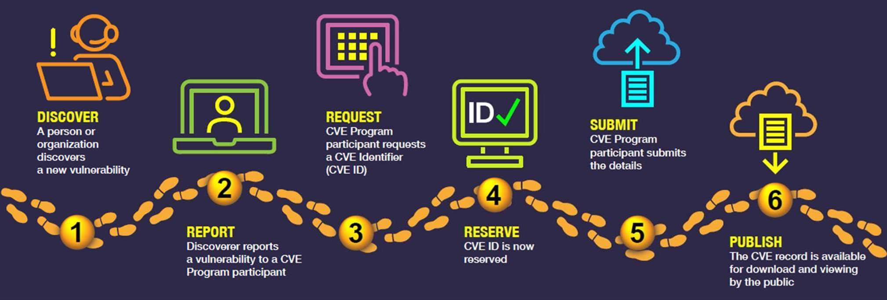

# Vulnerability Management 

## Introduction

While learning vulnerability management, I thought to write a blog on it. So here goes my detailed study on vulnerability management.

## What is a vulnerability ?

A vulnerability is a security flaw or weakness that allows an intruder to reduce a system’s information assurance. In simple terms, a vulnerability is a mis-configuration or weakness in the software or service, which can be exploited by a threat actor to get unauthorized access to the system. 

A vulnerability requires three elements: 

* System weakness
* Intruder’s access to the weakness
* Intruder’s ability to exploit the weakness using a tool or technique.

For example, 

* Unnecessary ports open to internet
* Insecure operating system configurations
* Outdated or unsupported third party software which may lead to multiple vulnerabilities, etc.

Note: According to various organizations and vendors, There are multiple definitions of **vulnerability** and all of them talk about weakness in a software/service/system.

Multiple new vulnerabilities are getting discovered by security researchers everyday on various softwares and opearting systems. So one might think who keeps track of these vulnerabilities and is there any standards being followed to track these vulnerabilities. To answer that we have to discuss regarding CVE - Common vulnerabilities and exposures.


### CVE and CVSS

A CVE(Common vulnerabilities and exposures) is a open data registry of publicly known cybersecurity vulnerabilities. Each vulnerability in CVE list has a CVE ID or we can say various vulnerabilities are being identified using CVE IDs.  CVE IDs are assigned by CVE numbering authority(CNAs). We can find all the CVEs in the NVD - National vulnerability database, which comes under NIST - national institute of standards and technology. CVE program is primarily opearted by The MITRE corporationm, which is the primary CNA. Under MITRE there are multiple sub-CNAs. When a security researcher(s) finds a vulnerability in application/service, then it can be requested for CVE. The below image illustrates how the CVE report process works.



Img Credit: [CVE.ORG](https://www.cve.org/About/Process)

>Apart from the National Vulnerability Database (NVD) Many public sources of vulnerability definitions exist, such as  or Microsoft’s security updates and are freely available. Additionally, several vendors offer access to private vulnerability databases via paid subscription.

Using this process thousands of CVEs are released every year. However all the vulnerabilities are not same, they come with various criterias. Let's say we have 2 vulnerabilities on our system and out of which one is really complex and another is really easy to exploit. In that case, it is obvious that one should always focus on the later one as a there is a bigger chance that a threat actor will try to exploit it. To priortize the remediation of vulnerabilities a scoring system is being used, which is called as CVSS - Common vulnerability scoring system. Various other vendors use their own scoring system, however CVSS is popularly used vulnerability scoring system.

As per [First.org](https://www.first.org/cvss/), The Common Vulnerability Scoring System (CVSS) provides a way to capture the principal characteristics of a vulnerability and produce a numerical score reflecting its severity. 

The numerical score can then be translated into a qualitative representation (such as low, medium, high, and critical) to help organizations properly assess and prioritize their vulnerability management processes.

There are various criterias using which CVSS is being calculated such as attack complexity, impact, privilege required etc. Infact there are 3 versions of CVSS and those are v1, v2, v3 and v3.1. Over the year CVSS scoring system has improved and multiple new criterias being added to the scoring system to make it more efficient and reliable. 


All the details related to CVSS scoring system can be found [here](https://www.first.org/cvss/specification-document). Sometimes it is really important and useful to understand the CVSS vector, CVSS metrics and scores. One can use this [calculator](https://www.first.org/cvss/calculator/3.1) to calculate CVSS score of a vulnerability.


**CVSS metrics:** There are various metrics, which is used to calculate the CVSS score or we can say which helps to priortize the remediation. CVSS is composed of three metric groups: Base, Temporal, and Environmental, each consisting of a set of metrics.


Img Credit: [first.org](https://www.first.org/cvss/specification-document)

**CVSS vector:** A CVSS vector is a syntactical representation of various metrics using which the score can be calculated. For example `CVSS:3.1/AV:N/AC:L/PR:H/UI:N/S:U/C:L/I:L/A:N` 

```
AV - Attack Vector (AV) : N - Network
AC - Attack Complexity (AC) : L - Low
PR - Privileges Required (PR) : H - High
UI - User Interaction (UI) : N - None
S - Scope : U - Unchanged
C - Confidentiality : L - Low
I - Intigrity : L - Low
A - Availability : N - None
```

**CVSS Score:** As we saw multiple CVSS metric groups are there, so we must have multiple CVSS scores per each group. These scores are being calculated using certain formulae. Which can be refered from [here](https://www.first.org/cvss/specification-document). 


> A zero-day vulnerability is a vulnerability in a system or device that has been disclosed but is not yet patched. An exploit that attacks a zero-day vulnerability is called a zero-day exploit.

Now we understand what is vulnerabilities, CVE and CVSS. It is there to help security engineers and organizations to priortize the remediation of vulnerabilities and stay safe over the internet or within the organization. When it comes to asset which can be have a vulnerability it can be company provided smartphone, a end user computer or a highly sofisticated server or a database containing public to anything very sensitive the organization or a network device like switch or router. 

If an attacker finds about any vulnerability and is be able to exploit the vulnerability then it is not so far for the attacker to get network wide access using other vulnerabilities present over the network. 

There can be thousands of assets in a computer and planning to fix or remediate these vulnerabilities sometimes becomes really difficult and that's where we need **vulnerability management**.

## What is vulnerability management ?

Vulnerability management is the process of identifying, evaluating, treating, and reporting on security vulnerabilities in systems and the software that runs on them. 

Various vulnerability management softwares are being used to perform this process. Vulnerability management softwares use vulnerability scanners or endpoint agents to find the software vulnerabilities on the servers/devices present in the network. Some famous vendors which are present in market who provide vulnerability management solutions are Qualys, Tenable, Rapid7 etc.

An organization can have a separate vulnerability management team under cybersecurity domain or Security operation center can take this responsbility. There's a vulnerability management lifecycle which is being followed by the organizations and cycle includes below steps.

1. Discover
2. Priortize assets
3. Assess
4. Report
5. Remediate
6. Verify

## 1.Discover

There can be lots of assets in a network. As discussed earlier, it can be anything connected to the network such as Mobiles, CC TV cameras, servers, IOT devices, End user computers, networking devices like switches, routers, load balancers etc. It is always not possible for an organization to keep track of all the assets present in the network. CMDB is being used to keep track of assets till some extend, but there is a bigger chance of an asset being missed out from CMDB due to lack of process or coordination between multiple teams. So a vulnerability management team need to discover all the assets present in the network, as one vulnerable host in the network can lead to complete network takeover or a big cyber attack.

The team can collect the data from CMDB, can refer the architecture or take help from network team to get the details of the subnets being used in the organization. Then with the help of a Vulnerability scan, then can run a discovery scan.


## References

1. https://www.rapid7.com/fundamentals/vulnerability-management-and-scanning/#:~:text=Vulnerability%20management%20is%20the%20process,minimizing%20their%20%22attack%20surface.%22

2. https://cybersecurity.att.com/blogs/security-essentials/vulnerability-management-explained

3. https://www.crowdstrike.com/cybersecurity-101/vulnerability-management/

4. https://www.exabeam.com/information-security/vulnerability-management/

5. https://www.servicenow.com/products/security-operations/what-is-vulnerability-management.html

6. https://www.cdc.gov/cancer/npcr/tools/security/vmlc.htm

7. https://www.cisa.gov/sites/default/files/publications/CRR_Resource_Guide-VM_0.pdf

8. https://www.first.org/cvss/specification-document

9. https://en.wikipedia.org/wiki/Common_Vulnerabilities_and_Exposures

10. https://www.cve.org/About/Process


